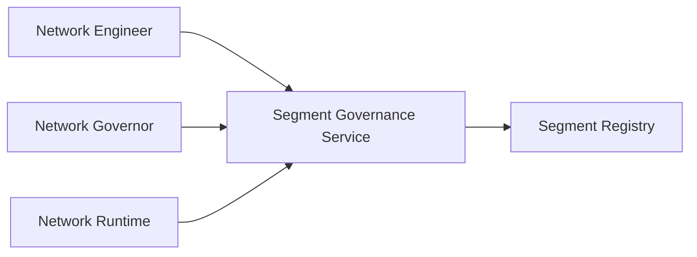
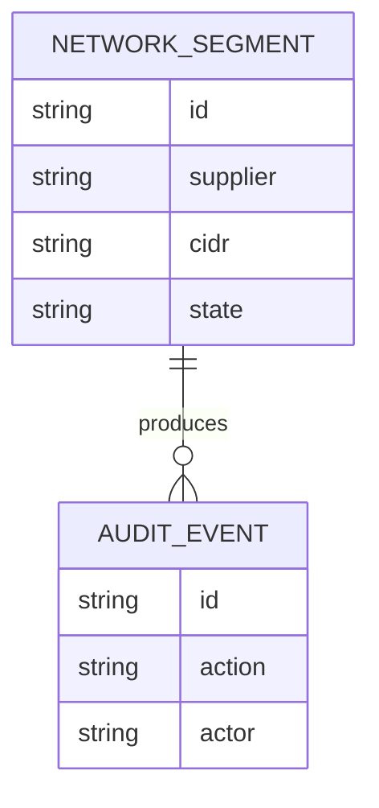
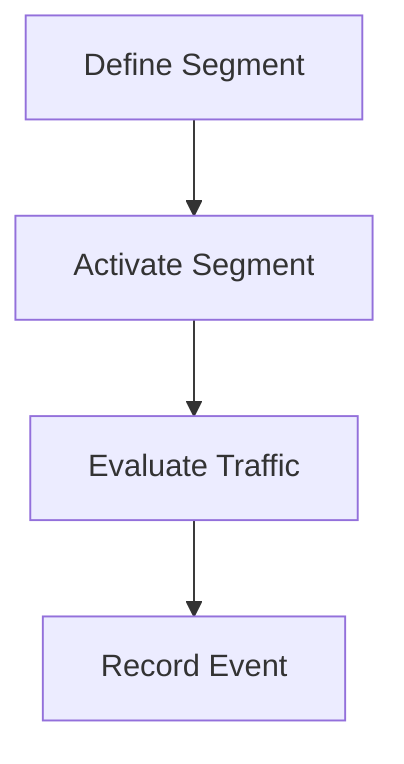
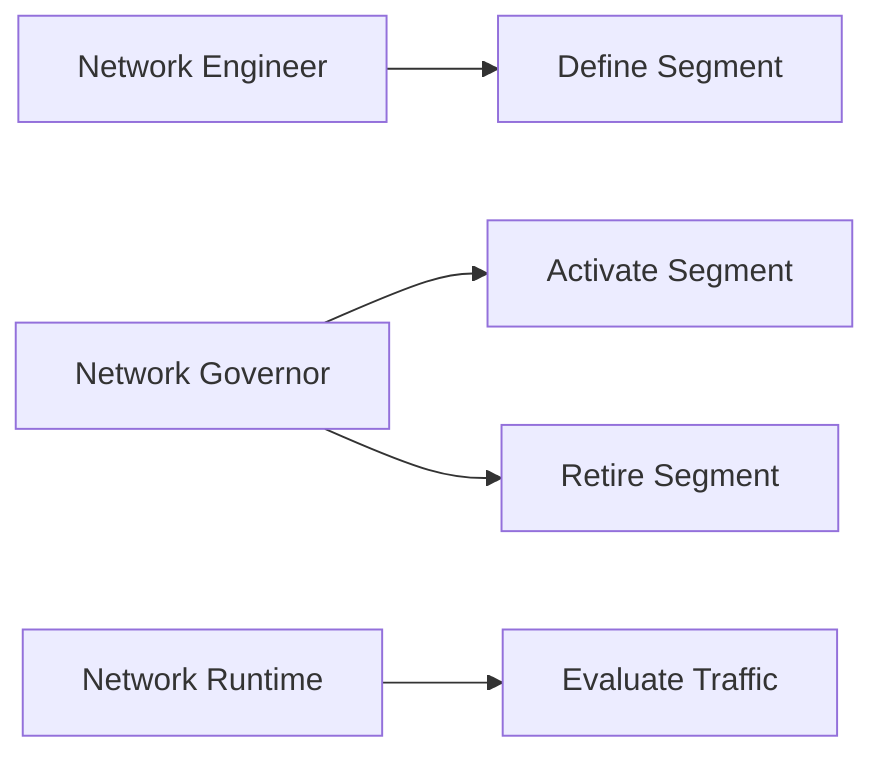
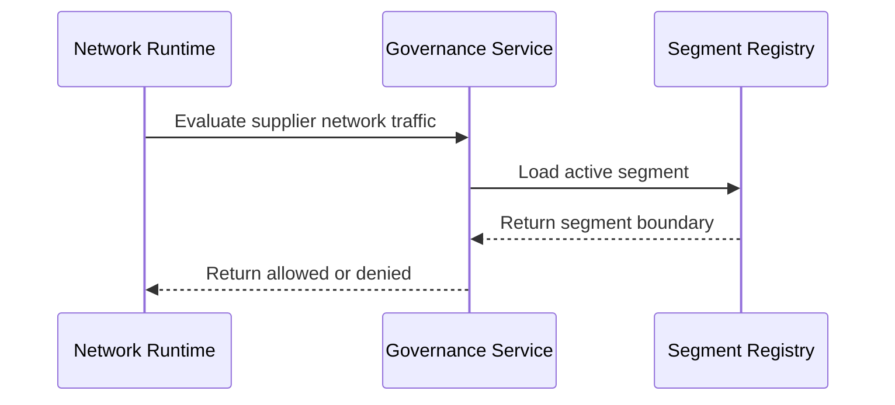

# Network Segmentation Supplier Governance Platform

## The Problem
Supplier traffic can cross unnecessary network boundaries when segment definition, boundary review, activation, and retirement are not governed through accountable controls.

## The Solution
This service governs supplier network segments. Network engineers define segments, network governors approve their activation or retirement, and runtime components evaluate traffic only against active, approved boundaries.

## Live Demo & Tech Stack
The LAN health endpoint is available at `http://0.0.0.0:28000/health`. The implementation uses Node.js, Express, Vitest, GitHub Actions, and network segmentation governance.

## Local Setup & Run Instructions
```bash
npm install
npm test
npm start
curl http://127.0.0.1:28000/health
```

## System Documentation (Mermaid.js)
### System Architecture Diagram

### Entity-Relationship Diagram (ERD)

### Data Flow Diagram

### Use Case Diagram

### Sequence Diagram


## Owner
Created and maintained by Kholipha Ahmmad Al-Amin.
Software Engineer and AI Specialist
Founder and CEO of EquiSaaS BD
Principal Consultant at AR IT Consultancy
Full Stack Developer and SaaS Product Builder
### Official links
Portfolio: https://kholipha-ahmmad-al-amin.equisaas-bd.com/
GitHub: https://github.com/kholipha-ahmmad-al-amin
LinkedIn: https://www.linkedin.com/in/kholipha-ahmmad-al-amin
X: https://x.com/al_amin5519
Facebook: https://www.facebook.com/kholipha.ahmmad.al.amin
Instagram: https://www.instagram.com/kholipha.ahmmad.al.amin
## Ownership
This project was created and is maintained by Kholipha Ahmmad Al-Amin.

